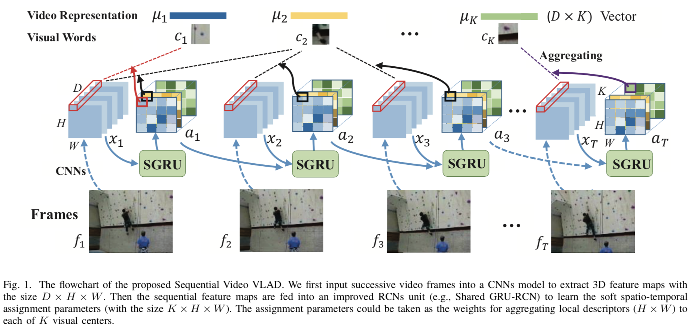

# SeqVLAD-Pytorch

*Now in experimental release, suggestions welcome*. 

## Paper

Youjiang Xu, Yahong Han, Richang Hong, Qi Tian. ["Sequential Video VLAD: Training the Aggregation 

Locally and Temporally."]() TIP, 2018. [[Paper\]]()

```
@inproceedings{Xu2018Sequential,
  author    = {Youjiang Xu and Yahong Han and Richang Hong and Qi Tian},
  title     = {Sequential Video VLAD: Training the Aggregation Locally and Temporally},
  booktitle = {TIP},
  year      = {2018},
}
```

## Framework



This is an implementation of Sequential VLAD (SeqVLAD) in PyTorch.

**Note**: always use `git clone --recursive https://github.com/youjiangxu/seqvlad-pytorch` to clone this project.
Otherwise you will not be able to use the inception series CNN archs.

# HMDB51

The split files in ``` ./data/hmdb51_splits/```  are provided by [ActionVLAD](https://github.com/rohitgirdhar/ActionVLAD#actionvlad-learning-spatio-temporal-aggregation-for-action-classification). They renamed the filename to avoid issues with special characters in the filenames. More details can be seen [here](https://github.com/rohitgirdhar/ActionVLAD#setting-up-the-data)


## Training

To train a new model, we can use the `main.py` script.

We can utilize the following ``` bash``` script to train the SeqVLAD with RGB inputs on the split 1 of HMDB51 : 

```bash
split=1
timesteps=25
num_centers=64
lr=0.02
dropout=0.8

first_step=80
second_step=150
total_epoch=210
two_steps=120
optim=SGD
prefix=hmdb51_rgb_split${split}
python ./main.py hmdb51 RGB ./data/hmdb51_splits/train_split${split}.txt ./data/hmdb51_splits/test_split${split}.txt \
      --arch BNInception \
      --timesteps ${timesteps} --num_centers ${num_centers} --redu_dim 512 \
      --gd 20 --lr ${lr} --lr_steps ${first_step} ${second_step} --epochs ${total_epoch} \
      -b 64 -j 8 --dropout ${dropout} \
      --snapshot_pref ./models/rgb/${prefix} \
      --sources <path to source rgb frames of hmdb51> \
      --two_steps ${two_steps} \
      --activation softmax \
      --optim ${optim}
```

When training with **Flow** inputs, it can be:

```bash
split=1
timesteps=25
num_centers=64
lr=0.01
dropout=0.7

first_step=90
second_step=180
third_step=210
total_epoch=240
two_steps=120

optim=SGD

prefix=hmdb51_flow_split${split}

python /mnt/lustre/xuyoujiang/action/seqvlad-pytorch/main.py hmdb51 Flow ./data/hmdb51_splits/train_split${split}.txt ./data/hmdb51_splits/test_split${split}.txt \
   --arch BNInception \
   --timesteps ${timesteps} --num_centers 64 --redu_dim 512 \
   --gd 20 --lr ${lr} --lr_steps ${first_step} ${second_step} --epochs ${total_epoch} \
   -b 64 -j 8 --dropout ${dropout} \
   --snapshot_pref ./models/flow/${prefix} \
   --sources <path to source optical frame of hmdb51> \
   --resume <path to tsn flow pretrained model> \
   --resume_type tsn --two_steps ${two_steps} \
   --activation softmax \
   --flow_pref flow_ \
   --optim ${optim}
```


### TSN Pretrained Model

**For the Flow stream, we utilized the tsn pretrained model to initialize our model.** Thus, we release the pretrained tsn models to reproduct our method easily. The pretrained models are released as follows: (the models are reimplemented by us, but not the official models.)

| Model  | Modality | Split | Link                                                         |
| ------ | -------- | ----- | ------------------------------------------------------------ |
| HMDB51 | RGB      | 1     | [hmdb51_bninception_split1_rgb_model_best.pth](https://tjueducn-my.sharepoint.com/:u:/g/personal/yjxu_tju_edu_cn/EXgsTfOClKlBvWygavN1BzgBNyLPd-Ukn7jBNj3t88q7jA?e=eu6PL0) |
| HMDB51 | RGB      | 2     | [hmdb51_bninception_split2_rgb_model_best.pth](https://tjueducn-my.sharepoint.com/:u:/g/personal/yjxu_tju_edu_cn/ETfn6SCeKqJBt3tDdA7JtK4BLdcSdYcnvXnL9RUJ9vUW9A?e=jvUjNG) |
| HMDB51 | RGB      | 3     | [hmdb51_bninception_split3_rgb_model_best.pth](https://tjueducn-my.sharepoint.com/:u:/g/personal/yjxu_tju_edu_cn/EWOThQmEPR5HjQStDJsyUbEB-1Zgjz_Jcf-bdR0AMuAhKA?e=rlgIrv) |
| HMDB51 | Flow     | 1     | [hmdb51_bninception_split1_flow_model_best.pth](https://tjueducn-my.sharepoint.com/:u:/g/personal/yjxu_tju_edu_cn/EXgsTfOClKlBvWygavN1BzgBNyLPd-Ukn7jBNj3t88q7jA?e=E5neqz) |
| HMDB51 | Flow     | 2     | [hmdb51_bninception_split2_flow_model_best.pth](https://tjueducn-my.sharepoint.com/:u:/g/personal/yjxu_tju_edu_cn/ERAS2JK9BSZCry_l1Ndtv6kB4rBdS-_vna_JNQ_Jast8OQ?e=1OUFel) |
| HMDB51 | Flow     | 3     | [hmdb51_bninception_split3_flow_model_best.pth](https://tjueducn-my.sharepoint.com/:u:/g/personal/yjxu_tju_edu_cn/EezS5HNGwf1IseTjKXcJ5IIBxjstXfC94AXYbzfmAFR5cw?e=hy3fhY) |


## Testing

After training, there will checkpoints saved by pytorch, for example `hmdb51_rgb_split1_checkpoint.pth`.

Use the following command to test its performance in the standard TSN testing protocol:

```bash
python test_models.py hmdb51 RGB ./data/hmdb51_splits/test_split${split}.txt \
       hmdb51_rgb_split1_checkpoint.pth \
       --arch BNInception \
       --save_scores seqvlad_split1_rgb_scores \
       --num_centers 64 \
       --timesteps 25 \
       --redu_dim 512 \
       --sources <path to source rgb frames of hmdb51> \
       --activation softmax \
       --test_segments 1
```

Or for flow models:

```bash   
python test_models.py hmdb51 Flow ./data/hmdb51_splits/test_split${split}.txt \
       hmdb51_flow_split1_checkpoint.pth \
       --arch BNInception \
       --save_scores seqvlad_split1_flow_scores \
       --num_centers 64 \
       --timesteps 25 \
       --redu_dim 512 \
       --sources <path to source optical frames of hmdb51> \
       --activation softmax \
       --test_segments 1 \
       --flow_pref flow_
```

**Note**: We first build our SeqVLAD on the repository of [old-seqvlad-pytorch](https://github.com/youjiangxu/tsn-pytorch/tree/seqvlad), which is folked from [tsn-pytorch](https://github.com/yjxiong/tsn-pytorch). And in order to reproduct our method easily, we release the source code in this repository [SeqVLAD-Pytorch](https://github.com/youjiangxu/seqvlad-pytorch).


## Quick Fusion

If you're only looking for our final last-layer features that can be combined with your method, we provide those for the following dataset:

```bash
./logits/hmdb51/
```

For example, you can use following command to merge two modality results (e.g., RGB+Flow) and obtain the final accuracy on HMDB51 split1.

```bash
python ./merge_hmdb.py --rgb ./logits/hmdb51/hmdb51_rgb_split1.npz --flow ./logits/hmdb51/hmdb51_flow_split1.npz
```


The performance (accuracy) of the seqvlad on HMDB51 is as follows:

| Split   | RGB   | Flow  | RGB+Flow |
| ------- | ----- | ----- | -------- |
| 1       | 55.23 | 65.36 | 72.88    |
| 2       | 54.31 | 74.77 | 70.39    |
| 3       | 53.66 | 65.49 | 71.18    |
| Average | 54.4  | 65.20 | 71.48    |

### UCF101 -TODO


### Useful Links
- [tsn-pytorch](https://github.com/yjxiong/tsn-pytorch)
- [tsn-caffe](https://github.com/yjxiong/temporal-segment-networks)

## Updates

- 2018-05-11 upload the pretrained tsn model, add logits.